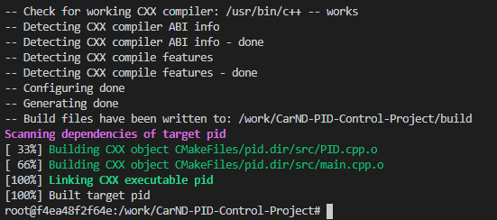

# PID Controller
---
## Rubric Points
---
Here I will consider [the rubic points](https://review.udacity.com/#!/rubrics/1972/view) individually and describe how I addressed each point in my implementation.

1. This code can be compiled
    It can be compiled as shown in the figure below.
    

1. The PID procedure follows what was taught in the lesson  
    Based on the content of the lesson, the throttle and steering angle are output using PID logic in the PID.cpp file and mai.cpp file.

1. Explains the impact of the P, I, and D components on the implementation  
    1. The "proportional" component had the most direct impact on the behavior of the car. This will cause the car to approach the target value in proportion to the deviation from the target value.  

    1. The "integral" component has the effect of suppressing deviations due to small manipulation amounts with respect to changes in target values ​​such as curves.

    1. The "differential" component has the effect of increasing the amount of operation in advance and suppressing overshoot when the target value may change due to a sharp curve or the like.  
    
    1. The final PID controller implementation was done like the following GIF  
    

1. Explains how the final hyperparameters were selected  
    Hyperparameters were initially adjusted manually. First, I and D were set to 0, P was determined, and an approximation that did not diverge was determined. Term I and D were determined in the same way. Based on this, I used Twiddle to optimize the parameters. Finally, the parameters are:  
    P: 0.242139  
    I: 0.00100188  
    D: 21.2176  
    
    also wanted to drive the car at 40 instead of 30 in a similar fashion. Therefore, I wanted to PID control the throttle value with the target speed and the current speed difference as CTS. As a result, the throttle PID parameters are:  
    P: 1.11531  
    I: 0.0031178  
    D: 41.5175  

1. Vehicles can orbit trucks  
    As you can see in the GIF above, I was able to go around without any problems
